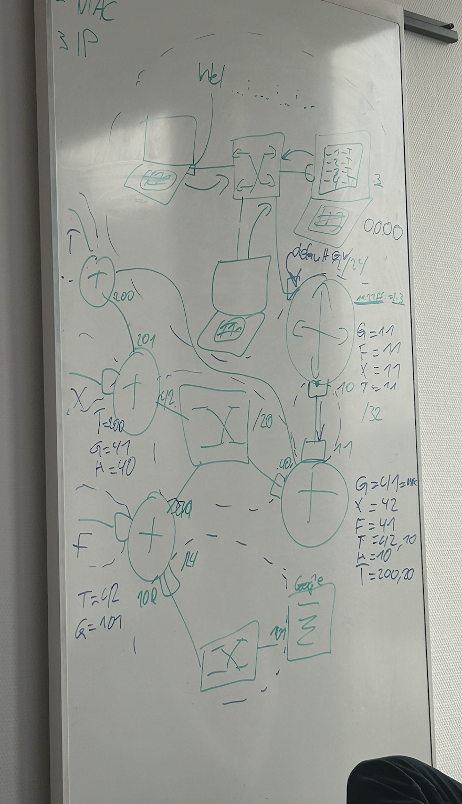

# Infrastructure - OSI Model
---------------------------------------------

### The OSI Model

### First Layer:
- This is the physical layer. It contains things like Cables, Keyboards, etc.
### Second Layer:
- The data link layer takes the data bits and “frames", and creates packets of the data to guarantee reliable transmission.
- This layer adds source and destination addresses to the data stream (MAC Address for example) as well as information to detect and control transmission errors. 
### Third Layer:
- The network layer is responsible for receiving frames from the data link layer, and delivering them to their intended destinations based on the addresses contained inside the frame. 
- The network layer finds the destination by using logical addresses, such as IP (internet protocol). At this layer, routers are a crucial component used to quite literally route information where it needs to go between networks.
- (Also see picture at the end)
### Fourth Layer:
This layer is about the transport with TCP or UDP.
#### **TCP:**
- Guarantees a safe and complete transport of the package
- Contains alarm system if something gets lost, etc.
- Sends and waits for response, after response sends the next message and so on
- Isn't practical for real-time connections such as live streams, phone calls, etc.
#### **UDP:**
- Doesn't wait for a response - sends message for message and hopes that receiver gets it
- If something doesn't reach the receiver UDP just sends it again
- Better for real-time connections such as livestreams, etc. for less delay
### Fifth Layer:
- This layer is for sessions, so that the user doesn't have to log in or request a new token every time for example.
### Sixth Layer:
- Formates data so that it becomes usable
### Seventh Layer:
- UI, Browser, etc.

### Notes
- 